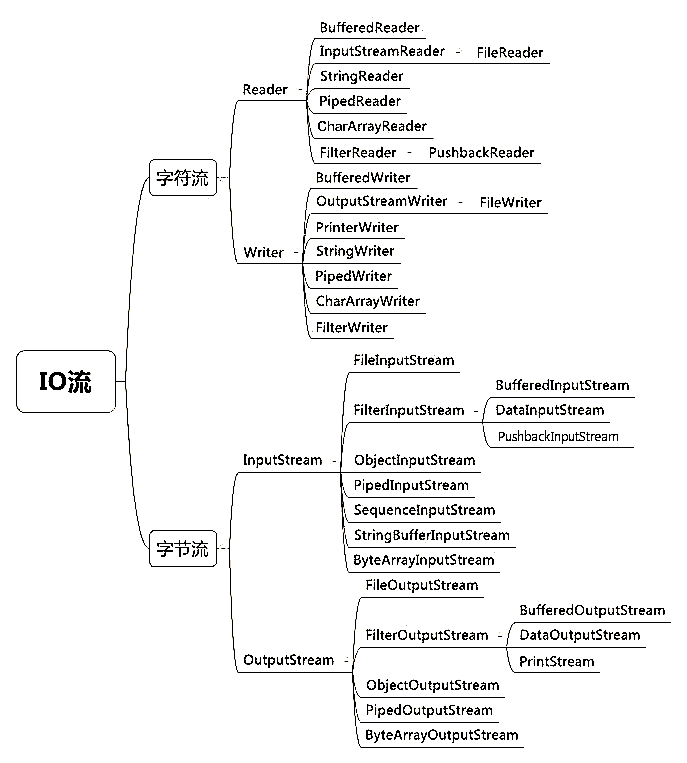

# Java I/O

## 处理外部数据

在 Java 程序中使用的数据通常来自外部数据来源，比如数据库、通过套接字直接传输的字节或文件存储。大部分收集和处理外部数据的 Java 工具都包含在 `java.io` 包中。

## 文件

在所有可用于 Java 应用程序的数据来源中，文件是最常见的，通常也是最方便的。如果想在 Java 应用程序中读取某个文件，必须使用将它的传入字节解析为 Java 语言类型的*流*。

`java.io.File` 是一个在文件系统上定义资源并以某种抽象方式表示该资源的类。创建 `File` 对象很容易：

```java
File f = new File("temp.txt");
File f2 = new File("/home/steve/testFile.txt");
```

`File` 构造方法接受它创建的文件的路径。

可以将任何 `String` 传递到 `File` 的构造方法，只要它是操作系统中的有效路径，无论它引用的文件是否存在。

通常，我们都需要向新创建的 `File` 对象询问该文件是否存在：

```java
File f2 = new File("/home/steve/testFile.txt");
if (f2.exists()) {
  // File exists. Process it...
} else {
  // File doesn't exist. Create it...
  f2.createNewFile();
}
```

### 文件操作

利用 `java.io.File`，通过 File 对象，我们可以操作文件：

* 文件是否存在：`FileObject.exists()`
* 创建文件：`FileObject.createNewFile()`
* 删除文件：`FileObject.delete`

还有很多操作，详见 [JDK 文档](https://docs.oracle.com/en/java/javase/12/docs/api/java.base/java/io/File.html)。

## 在 Java I/O 中使用流

我们可以使用流来访问文件系统上的文件。

流允许程序从来源接收字节或将输出发送到目标。

在 `java.io` 包中包含多种风格的流，一些流可以处理所有类型的 16 位字符（`Reader` 和 `Writer` 类型）。其他流仅能处理 8 位字节（`InputStream` 和 `OutputStream` 类型）。

### Java IO 流



#### 字节流

**字节流**读（`InputStream` 和子类）和写（`OutputStream` 和子类）8 位字节。换句话说，可以将字节流视为一种更加原始的流类型。下面总结了两种常见的字节流和它们的用法：

- `FileInputStream` / `FileOutputStream`：从文件读取字节，将字节写入文件 
- `ByteArrayInputStream` / `ByteArrayOutputStream`：从内存型中的数组读取字节，将字节写入内存中的数组

#### 字符流

**字符流**读（`Reader` 和它的子类）和写（`Writer` 和它的子类）16 位字符。下面挑选了一些字符流和它们的用法：

- `StringReader` / `StringWriter`：在内存中的 `String` 中读取和写入字符。 
- `InputStreamReader` / `InputStreamWriter`（和子类`FileReader` / `FileWriter`）：充当字节流和字符流之间的桥梁。`Reader` 从字节流读取字节并转换为字符。`Writer` 将字符转换为字节，以便将它们放在字节流上。 
- `BufferedReader` / `BufferedWriter`：在读取或写入另一个流时缓冲数据，使读写操作更高效。

### 读取控制台输入

Java 的控制台输入由 `System.in` 完成。

为了获得一个绑定到控制台的字符流，我们把 `System.in` 包装在一个 `BufferedReader` 对象中来创建一个字符流：

``` java
BufferedReader br = new BufferedReader(new 
                     InputStreamReader(System.in));
```

BufferedReader 对象创建后，我们便可以使用 `read()` 方法从控制台读取一个字符，或者用 `readLine()` 方法读取一个字符串：

* `int read() throws IOException` ：调用 read() 方法，它从输入流读取一个字符并把该字符作为整数值返回。 当流结束的时候返回 -1。该方法抛出 IOException。
* `String readLine() throws IOException` ：与 read() 类型，但读取一个字符串。

实例（读取字符）：

``` java
// 使用 BufferedReader 在控制台读取字符
public static void chrRead() throws IOException {
  // 用 System.in 创建 BufferedReader
  BufferedReader br = new BufferedReader(new InputStreamReader(System.in));
  System.out.println("输入字符，到'q'退出：");
  // 读取字符
  for (char character = '\0'; character != 'q'; ) {
    character = (char) br.read();
    System.out.println(character);
  }
}
```

~~😂有意思的是~~，这对代码的作用和下面这 **一行**Python代码是一样的：

```python
print('\n'.join([c for c in input("输入字符，到\'q\'退出：\n").split('q')[0] + 'q']))
```

实例（读取字符串）：

```java
// 使用 BufferedReader 在控制台读取字符串
public static void strRead() throws IOException {
  BufferedReader br = new BufferedReader(new InputStreamReader(System.in));
  System.out.println("Please enter lines of text, 'end' to quit: ");
  // 读取字符串
  for (String line = "\0"; !line.equals("end"); ) {
    line = (String) br.readLine();
    System.out.println(line);
  }
}
```

####  scanner

其实，更容易地，我们也可以通过 `java.util.Scanner` 类来获取用户的输入。

##### 创建 scanner

``` java
Scanner s = new Scanner(System.in);
```

##### 使用 scanner

通过使用 `Scanner` 类的 `next()` 与 `nextLine()` 方法获取输入的字符串，在读取前我们一般需要 使用 `hasNext` 与 `hasNextLine` 判断是否还有输入的数据:

``` java
package mine.java.tour;

import java.util.Scanner;

public class TryScanner {
	public static void main(String[] args) {
		Scanner scan = new Scanner(System.in);
		/*
		System.out.println("Please enter something:");
		for (String read = "\0"; scan.hasNext(); ) {
			read = scan.next();
			System.out.println(read);
		}
		*/
		System.out.println("Please enter some lines:");
		for (String read = "\0"; scan.hasNextLine(); ) {
			read = scan.nextLine();
			System.out.println(read);
		}
		scan.close();
	}
}
```

###### next() 与 nextLine() 区别

* `next()`:
  1. 一定要读取到有效字符后才可以结束输入。
  2. 对输入有效字符之前遇到的空白，next() 方法会自动将其去掉。
  3. 只有输入有效字符后才将其后面输入的空白作为分隔符或者结束符。 
  4. next() 不能得到带有空格的字符串。

* `nextLine()`： 
  1. 以Enter为结束符,也就是说 nextLine()方法返回的是输入回车之前的所有字符。 
  2. 可以获得空白。

另外，如果要输入 `int` 或 `float` 类型的数据，在 `Scanner` 类中也有支持，但是在输入之前最好先使用 `hasNextXxx()` 方法进行验证，再使用 `nextXxx()` 来读取。

### 文件读写

#### FileInputStream

`FileInputStream` 用于从文件读取数据。

可以使用字符串类型的文件名来创建一个输入流对象来读取文件：

``` java
InputStream f = new FileInputStream("/home/steve/testFile.txt");
```

也可以使用一个文件对象来创建一个输入流对象来读取文件：

```java
File f = new File("/home/steve/testFile.txt");
InputStream out = new FileInputStream(f);
```

##### 操作

| 方法                                           | 描述                                                         |
| ---------------------------------------------- | ------------------------------------------------------------ |
| `public void close() throws IOException`       | 关闭此文件输入流并释放与此流有关的所有系统资源。             |
| `protected void finalize()throws IOException`  | 这个方法清除与该文件的连接。确保在不再引用文件输入流时调用其 close 方法。 |
| `public int read(int r)throws IOException`     | 从 InputStream 对象读取指定字节的数据。返回为整数值。返回下一字节数据，如果已经到结尾则返回-1。 |
| `public int read(byte[] r) throws IOException` | 从输入流读取r.length长度的字节。返回读取的字节数。如果是文件结尾则返回-1。 |
| `public int available() throws IOException`    | 返回下一次对此输入流调用的方法可以不受阻塞地从此输入流读取的字节数。返回一个整数值。 |

#### FileOutputStream

同样可以用路径字符串和文件对象来构造：

```java
OutputStream f = new FileOutputStream("/home/steve/testFile.txt")
```

```java
File f = new File("/home/steve/testFile.txt");
OutputStream f = new FileOutputStream(f);
```

##### 操作

| 方法                                          | 描述                                                         |
| --------------------------------------------- | ------------------------------------------------------------ |
| `public void close() throws IOException`      | 关闭此文件输入流并释放与此流有关的所有系统资源。             |
| `protected void finalize()throws IOException` | 这个方法清除与该文件的连接。确保在不再引用文件输入流时调用其 close 方法。 |
| `public void write(int w)throws IOException`  | 把指定的字节写到输出流中。                                   |
| `public void write(byte[] w)`                 | 把指定数组中w.length长度的字节写到OutputStream中。           |

#### 实例

``` java
package mine.java.tour;

import java.io.*;
import java.util.logging.Logger;

public class FileStream {
	private static Logger l = Logger.getLogger("Test");

	// 通过 byte 以二进制的形式读写文件
	public static void ioByByte() throws IOException {
		l.info("通过 byte 以二进制的形式读写文件:");
		try (
				OutputStream ostream = new FileOutputStream("test.txt");
				InputStream istream = new FileInputStream("test.txt");
				) {
			// 写入文件
			byte toBeWritten[] = {0x43, 0x44, 0x46, 0x4d, 0x4c, 0x52};
			for (int i : toBeWritten) {
				ostream.write(i);
			}
			// 从文件中读取
			int fileSize = istream.available();
			for (int i = 0; i < fileSize; i++) {
				System.out.print((char)istream.read());
			}
			System.out.print("\n");
		} catch (IOException e) {
			l.severe("IOException: " + e);
		}
	}
	// 读写中文(Unicode)
	public static void ioUnicode() throws IOException {
		l.info("读写中文(Unicode):");
		File fileForIO = new File("测试.txt");
		if (!fileForIO.exists()) {
			fileForIO.createNewFile();
		}
		// 写
		OutputStream ostream = new FileOutputStream(fileForIO);
		OutputStreamWriter writer = new OutputStreamWriter(ostream, "UTF-8");
		try {
			writer.append("中文");
			writer.append("\n");
			writer.append("English");
		} catch (IOException e) {
			l.severe("Fail to write: " + e);
		} finally {
			if (writer != null) writer.close();
			if (ostream != null) ostream.close();
		}
		// 读
		InputStream istream = new FileInputStream(fileForIO);
		InputStreamReader reader = new InputStreamReader(istream, "UTF-8");
		try {
			StringBuffer sb = new StringBuffer();	
			while (reader.ready()) {
				sb.append((char)reader.read());
			}
			String result = sb.toString();
			System.out.println(result);
		} catch (IOException e) {
			l.severe("Fail to read: " + e);
		} finally {
			if (reader != null) reader.close();
			if (istream != null) istream.close();
		}
	}

	public static void main(String[] args) throws IOException {
		ioByByte();
		ioUnicode();
	}
}
```

运行这个程序，输出如下：

```
5月 03, 2019 8:31:07 下午 mine.java.tour.FileStream ioByByte
信息: 通过 byte 以二进制的形式读写文件:
CDFMLR
5月 03, 2019 8:31:08 下午 mine.java.tour.FileStream ioUnicode
信息: 读写中文(Unicode):
中文
English
```

~~😂讽刺的是~~，它的作用和下面这段 Python 代码差不多：

``` python
with open("Test.txt", "w") as f:
    f.write("CDFMLR")
with open("Test.txt", "r") as f:
    print(f.read())
with open("测试.txt", "w", encoding="UTF-8") as f:
    f.write("中文\nEnglish")
with open("测试.txt", "r", encoding="UTF-8") as f:
    print(f.read())
```

---

相关代码：

[SystemIn.java](./src/SystemIn.java)

[FileStream.java](./src/FileStream.java)

[TryScanner.java](./src/TryScanner.java)

